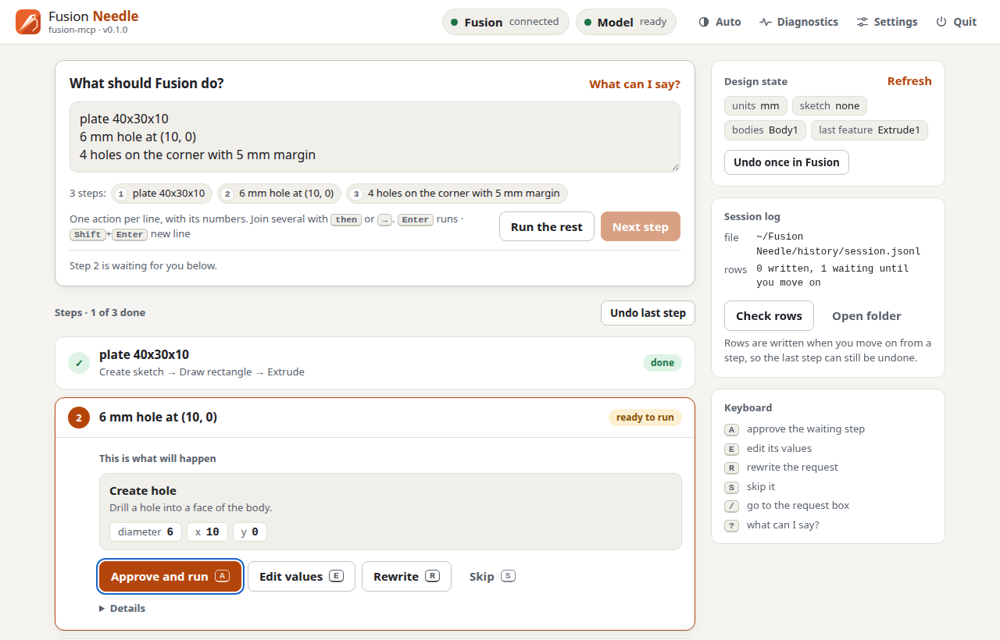
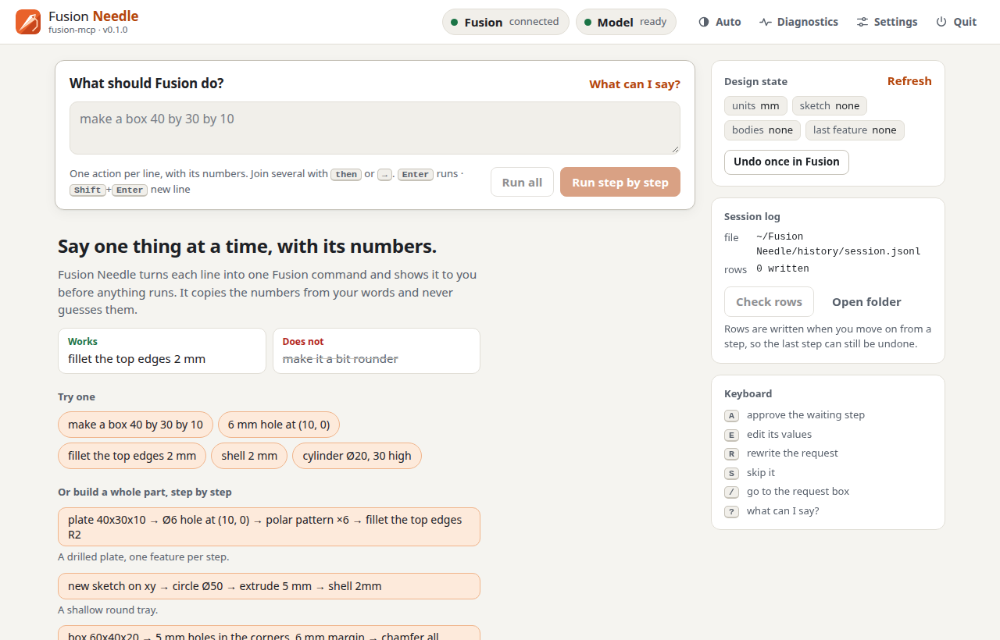
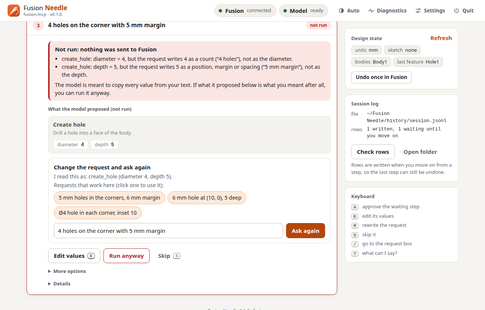

<p align="center">
  
</p>

<h1 align="center">Fusion Needle</h1>

**Type what you want to model, and Fusion Needle creates it in Autodesk Fusion, one step at a time.**

```
plate 40x30x10, then a 6 mm hole in the middle, then round the top edges 2 mm
```

Fusion Needle is a small desktop app. You write a list of features in plain words. A small model that runs on
your own computer turns each feature into actions, shows them to you, and then carries them out in Fusion.
Your text and your designs are not sent to a cloud service.

[](https://github.com/CharlZKP/fusion-needle-app/releases/latest)
[](LICENSE)


<p align="center">
  
</p>

> [!WARNING]
> **Early version, not yet tried with a real Fusion.** It has only been tested against a stand-in for Fusion.
> Please read [Status](#status) first, and use it on designs you can afford to break.

## Contents

**Using the app**

- [Download](#download)
- [Get started in six steps](#get-started-in-six-steps)
- [What you can ask for](#what-you-can-ask-for)
- [If something goes wrong](#if-something-goes-wrong)
- [Status](#status)

**For developers**

- [Requirements](#requirements)
- [Run from source](#run-from-source)
- [Tests](#tests)
- [Project layout](#project-layout)
- [How a step runs](#how-a-step-runs)
- [Safety rules](#safety-rules)
- [How the model download works](#how-the-model-download-works)
- [Configuration](#configuration)
- [Building the packages](#building-the-packages)
- [Release workflow](#release-workflow)
- [Contributing](#contributing)
- [Credits](#credits)
- [Licence](#licence)

## Download

### [Get the latest release](https://github.com/CharlZKP/fusion-needle-app/releases/latest)

On that page, open **Assets** and pick the file for your computer by the way its name ends:

| Your computer | Pick the file ending in |
| --- | --- |
| **Windows** 10 or 11 (64-bit) | `-windows-x86_64.zip` |
| **Mac** with Apple silicon | `-macos-arm64.tar.gz` |
| **Linux** (64-bit Intel or AMD) | `-linux-x86_64.tar.gz` |

The file names start with `FusionNeedle-` and the version number. You can ignore the small `.sha256` files and
the "Source code" entries. There is no build for Macs with an Intel processor.

You also need **Autodesk Fusion** on the same computer. Fusion Needle does not include it.

## Get started in six steps

You do not need to install anything else. The download is the whole app.

### 1. Unpack the download

- **Windows:** right-click the `.zip` file and choose **Extract All**.
- **Mac and Linux:** double-click the `.tar.gz` file, or use your file manager's "Extract" entry.

You get a folder called `FusionNeedle`. Put it wherever you like.

### 2. Start the app

| System | Double-click |
| --- | --- |
| Windows | `FusionNeedle.exe` inside the `FusionNeedle` folder (or `Start Fusion Needle.bat` next to it) |
| Mac | `FusionNeedle` inside the `FusionNeedle` folder |
| Linux | `FusionNeedle` inside the `FusionNeedle` folder |

The app opens as a page in your web browser. The page is served by your own computer, not by a website.
On Mac and Linux a terminal window comes with it; leave that window open while you work.
To close the app, use **Quit** in its top bar.

**Your system will warn you the first time.** The builds are not code-signed, which means Windows and macOS
cannot check who made them and say so:

- **Windows** shows "Windows protected your PC". Click **More info**, then **Run anyway**.
- **macOS** says the app cannot be opened or is from an unidentified developer. Right-click (or Control-click)
  `FusionNeedle`, choose **Open**, then **Open** again. On newer macOS versions, try to open it once, then go
  to **System Settings → Privacy & Security** and click **Open Anyway**. If macOS still refuses, see
  [macOS still blocks the app](#if-something-goes-wrong).

### 3. Wait for the model, once

The first time it starts, the app downloads its model from
[Hugging Face](https://huggingface.co/CharlZKP/fusion-needle3), a site that hosts models. It is a few tens of megabytes.
The **Model** indicator at the top shows the progress and the exact size, and turns green when it is ready.

This happens one time only. After that the app works without an internet connection.

### 4. Open Fusion and switch on its MCP server

Fusion Needle talks to Fusion through a feature of Fusion itself called the **MCP server**: a built-in door that
lets other programs on your computer ask Fusion to do things. It has to be switched on in Fusion.

1. Start Autodesk Fusion.
2. Open a design. A new, empty one is fine.
3. Switch on Fusion's MCP server. Where this setting is depends on your Fusion version; Autodesk's Fusion help
   describes it (search the help for "MCP server").

<!-- TODO(owner): write the exact menu path for enabling the MCP server in Fusion here once it has been seen
     in a real Fusion, and add a screenshot (docs/screenshots/fusion-mcp-setting.png). The project material
     only says "enable its MCP server" and gives the address the server listens on. -->

When Fusion Needle finds Fusion, the **Fusion** indicator at the top turns green. It looks again every few
seconds, so you do not need to restart anything.

### 5. Run "Check Fusion"

Click **Diagnostics** in the top bar, then **Check Fusion**. This only reads from Fusion. It changes nothing in
your design and does not move the view. Every line should say `pass`.

If the line **Up axis** says `FAIL`, your document has Y pointing up, and the app expects Z up. In Fusion, set
**Preferences > General > Default modeling orientation** to "Z up" and start a new document before you build
anything.

### 6. Type your first goal

In the **Goal** box, write something small:

```
plate 40x30x10
```

Then click **Step by step**. The app shows what it is about to do in Fusion, and you confirm each step.
**Run all** goes through the whole list and only stops where it has to ask you.

For more than one feature, separate them with the word `then`, an arrow (`→` or `->`), or a new line:

```
plate 40x30x10
Ø6 hole at (10, 0)
polar pattern ×6
fillet the top edges R2
```

| Start here | When a request cannot be run as written |
| --- | --- |
|  |  |

## What you can ask for

The model picks from 47 actions. These are examples of the kind of request each group is for:

| For | You can write, for example |
| --- | --- |
| **Sketching** | `start a sketch on the XY plane`<br>`sketch on the top face`<br>`rectangle 40 x 30`<br>`circle Ø12 at (10, 0)`<br>`slot 20x6`<br>`hexagon 10 across flats`<br>`arc radius 15 from 0 to 90 degrees` |
| **Solid shapes** | `plate 40x30x10`<br>`extrude 10`<br>`cut through all`<br>`revolve around the Z axis`<br>`shell 2 mm, top face open`<br>`mirror the body across the YZ plane`<br>`join the bodies` |
| **Holes and patterns** | `Ø6 hole at (10, 0)`<br>`6 mm hole in the top face, 8 deep`<br>`polar pattern ×6`<br>`pattern 4 along X, 12 apart` |
| **Edges** | `fillet the top edges R2`<br>`chamfer all edges 1` |
| **Materials and parameters** | `set the material to aluminum`<br>`set parameter wall to 3 mm`<br>`list the parameters` |
| **Checking** | `measure the body`<br>`check the timeline for errors` |
| **Views and screenshots** | `fit the view`<br>`screenshot from the front` |
| **Export and save** | `export as STEP`<br>`export as STL`<br>`save the document`<br>`open the document named bracket` |
| **Undo** | `undo`<br>`redo` |

Also available: straight lines, dimensions and constraints inside a sketch, and moving a body.
Materials it knows by name: steel, stainless steel, aluminum, brass, copper, titanium, ABS, nylon.
Export formats: STEP, STL, 3MF, IGES and F3D. The complete list with every option is under
[How a step runs](#how-a-step-runs).

These examples show what each action is for. They are not a promise that every wording is understood equally
well; the [model card](https://huggingface.co/CharlZKP/fusion-needle3) says how the model does.

> [!TIP]
> **How to phrase it**
>
> - **One feature per step.** "Plate, then hole, then fillet" is three steps, not one sentence.
> - **Write the numbers and units you mean.** The app copies values from your text. It does not convert,
>   calculate or estimate. Write `Ø6` or `6 mm hole`, not "a small hole".
> - **It asks instead of guessing.** If a number is missing ("make a hole" has no diameter) or nothing fits,
>   the app stops and lets you rewrite the step. It never fills in a value for you.
> - **It always asks before saving, opening or creating a document.** It cannot close a document at all.
> - **Exports go to a folder you choose** in Settings, and never overwrite a file.

## If something goes wrong

**The Fusion indicator stays red ("not connected").**
Check three things: Fusion is running, a design is open, and Fusion's MCP server is switched on. The app looks
again every few seconds. If your Fusion uses a different address, you can change it under **Settings**
("Fusion MCP address").

**The app says Fusion has a dialog open.**
Fusion cannot carry out a step while one of its own command dialogs is open. Finish or cancel the dialog in
Fusion, then continue in the app. If the app says it *could not tell* whether a dialog is open and you can see
that none is, **Proceed anyway (this step)** sends the step.

**The model download failed, or the Model indicator is red.**
Check your internet connection and start the app again. A download that was interrupted continues where it
stopped. You can also click the **Model** indicator and choose **Restart model**; the same window shows the
reason. Some office networks block huggingface.co, in which case try another network.

**Nothing happened, or it asked me to rewrite the step.**
That is normal and not an error. It means no action fits, or a number it needs is not in your text. What you
built so far stays. Rewrite the step with the number in it, and keep to one feature per step.

**A step failed halfway.**
The app undoes what that step already did in Fusion, stops, and shows Fusion's error. **Undo last step** in the
app takes back the most recent step.

**"Top" is not where I expect it, or things are built sideways.**
Run **Diagnostics → Check Fusion** and look at the **Up axis** line (see [step 5](#5-run-check-fusion)).

**Windows or my antivirus blocks or removes the app.**
The builds are not code-signed, so Windows SmartScreen warns about an unknown publisher: **More info → Run
anyway**. Antivirus software sometimes quarantines apps packaged this way; if `FusionNeedle.exe` has
disappeared from the folder, that is what happened, and you would need to restore it in your antivirus.

**macOS still blocks the app.**
Right-click → **Open** and **System Settings → Privacy & Security → Open Anyway** are the two ways without
typing anything. If neither works, the unpacked folder still carries the "downloaded from the internet" mark,
and removing it takes one command; see [Building the packages](#building-the-packages).

### Sending diagnostics

If you report a problem, please send the diagnostics file with it:

1. Click **Diagnostics** in the top bar.
2. Click **Export diagnostics**. The app writes one zip file and shows where it is; **Open folder** takes you
   there.
3. Attach the zip to [a new issue](https://github.com/CharlZKP/fusion-needle-app/issues), with your Fusion version (Help > About in Fusion)
   and your operating system.

The zip contains what the app sent to Fusion and what Fusion answered, the result of "Check Fusion", version
numbers and your settings. It also contains the text of your steps and file names, so look inside before you
share it. It does not contain tokens.

## Status

This is version 0.1.0, an early release. In plain words:

- **It has not been run with a real Autodesk Fusion yet**, on any system.
- It runs on **Linux**. It has **not been started on Windows or macOS** yet.

In detail:

| Area | Where it stands |
| --- | --- |
| **Real Autodesk Fusion, any platform** | **Unverified.** No script of this project has been executed in a real Fusion design yet. The templates are syntax-checked and run against a stub of the Fusion API, and the app is tested against a stand-in for Fusion's MCP server (`tests/fake_fusion.py`). The shapes of Fusion's answers come from third-party reference material and recordings made by others, not from our own runs. |
| App and tests on Linux | Run. The PyInstaller build has been made and started on Linux x86_64. |
| App on Windows | **Unverified.** The launcher (`Start Fusion Needle.bat`), the build script, and the Windows half of the process supervision (Job Objects) were written and reviewed, not run. [`packaging/README.md`](packaging/README.md) is the step-by-step first-run check. |
| App on macOS | **Unverified.** Never started on macOS; the first CI build is the first run. |
| Model quality | See the [model card](https://huggingface.co/CharlZKP/fusion-needle3). |

So the Windows and macOS steps above describe what is expected to happen, not what has been watched happening.

Known assumptions that a first session with a real Fusion has to confirm, most important first:

1. **Which way is up.** The templates assume a Z-up document (`top` = +Z, `front` = −Y). In a Y-up document
   face names, "top edges" and view directions will not match what you see. "Diagnostics → Check Fusion" reads
   the orientation and says so; it changes nothing in the design.
2. **How Fusion reports a script that failed.** The app treats `isError`, `success: false` and a JSON-RPC error
   as failure. If Fusion reports it differently, a failed call could look successful.
3. **The dialog check.** The answer Fusion gives while a real command dialog is open has not been observed by
   this project.
4. **Each template**: sketch axes on the XZ and YZ planes and on faces, extrude directions, hole placement,
   edge selection for fillet and chamfer, patterns, material names (they vary by Fusion version and language),
   export options, and what the document tools do on an unsaved document.

Use it on designs you can afford to break, and keep Fusion's own version history on.

If you try it on a real Fusion, please [open an issue](https://github.com/CharlZKP/fusion-needle-app/issues) with the
[diagnostics export](#sending-diagnostics), whatever the result.

<br>

---

# For developers

Everything below is for people who want to run the app from source, change it or build it.

In short: for each step a small on-device model (a fine-tune of
[Needle 3](https://cactuscompute.com/needle) by Cactus Compute, a few tens of megabytes) picks up to four narrow
tool calls, and vetted Python templates turn each call into the script that Fusion's own MCP server runs.
The model never writes code, nothing leaves your machine, and every call is shown before it runs.

## Requirements

- **Autodesk Fusion with its MCP server enabled.** The app talks to the server Fusion runs on
  `http://127.0.0.1:27182/mcp` (the address can be changed in Settings).
- Windows 10/11 (64-bit), macOS on Apple silicon, or Linux x86_64.
- Internet access on the first start only: the model is downloaded once from
  [huggingface.co/CharlZKP/fusion-needle3](https://huggingface.co/CharlZKP/fusion-needle3). After that the app works offline.
- Running from source additionally needs Python 3.12 or newer (64-bit).

## Run from source

```sh
git clone https://github.com/CharlZKP/fusion-needle-app.git
cd fusion-needle-app
python3.12 -m venv .venv
.venv/bin/python -m pip install -e .            # Windows: .venv\Scripts\python -m pip install -e .
.venv/bin/python fusion_needle.py               # or one of the launchers in this folder
```

The app opens in your browser, or in its own window when `pywebview` is available
(`pip install -e ".[window]"` adds it).

Launchers in this folder, all of which look for a packaged build next to them first, then the repository's
`.venv`, then a Python 3.12 or newer:

| File | For |
| --- | --- |
| `Start Fusion Needle.bat` | Windows (double-click) |
| `Start Fusion Needle.command` | macOS (double-click in Finder) |
| `start-fusion-needle.sh` | Linux and macOS |
| `fusion-needle.desktop` | Linux desktop entry that runs the script above |

<details>
<summary>Options for one launch</summary>

| Option | Meaning |
| --- | --- |
| `--weights auto \| base \| path/to/model.cact` | which model to use (see [Configuration](#configuration)) |
| `--fusion-url URL` | address of Fusion's MCP server |
| `--window auto\|native\|browser\|none` | own window (`pywebview`), browser tab, or serve only |
| `--headless` | same as `--window none` |
| `--port N` | port of the local UI (default: a free one) |
| `--model-url URL` | use a step server that is already running |
| `--model-token TOKEN` | that server's token |
| `--no-model` | do not start or connect a model (UI only) |
| `--config-dir DIR` | settings folder for this launch |
| `--version` | print the version |

</details>

## Tests

No Fusion and no model are needed; a stand-in for Fusion's MCP server is part of the tests.

```sh
.venv/bin/python -m pip install -e ".[dev]"
.venv/bin/python -m pytest -q
```

`python tests/fake_fusion.py --port 27182` runs that stand-in on its own, so the whole app can be tried without
Fusion.

CI ([`.github/workflows/ci.yml`](.github/workflows/ci.yml)) runs the same tests with Python 3.12 on Linux, macOS
and Windows for every pull request and every push to `main`.

## Project layout

```
fusion_needle.py          entry point (also what the packaged executable runs)
app/                      the app: local web UI, the step loop, the Fusion MCP client, model download
stepserver/               local JSON API in front of the Needle engine (started by the app)
projects/fusion-mcp/      tools/ (catalogue and routing hints) and backend/ (renderer and script templates)
scripts/download_model.py fetch the model ahead of the first start
packaging/                PyInstaller spec and build scripts
tests/                    pytest suite and the stand-in Fusion server
```

## How a step runs

```
goal ──split──▶ features ──▶ for each feature:
                              1. read the design state from Fusion     (read-only script)
                              2. ask the model for the calls           (local step server)
                              3. show the calls; ask when a rule says so
                              4. render each call to a script and run it in Fusion
                              5. on a failure: undo the calls of this step, stop, show the error
```

- A goal is split on `→`, `->`, the word `then` and new lines. Each feature is sent exactly as written.
- The model sees one feature, a one-line state (`units: mm; sketch: none; bodies: Body1; last_feature: Extrude1`)
  and at most five tool schemas. It answers with 0 to 4 calls.
- An empty answer is a normal outcome: no tool applies, or a required value is not in the text ("make a hole"
  has no diameter). The app stops there and lets you rewrite the feature. It never fills a value in for you.
- **Write the numbers.** Argument values are copied from your text. Nothing is converted or computed:
  write `Ø6`, not "a small hole".

<details>
<summary>All 47 tools the model chooses among</summary>

From [`projects/fusion-mcp/tools/catalogue.json`](projects/fusion-mcp/tools/catalogue.json):

| Tool | What it does | Required | Optional |
| --- | --- | --- | --- |
| `create_sketch` | Start a new sketch on an origin plane or on a face of the body. |  | `plane`, `face`, `offset` |
| `draw_rectangle` | Draw a rectangle in the active sketch, centred on a point. | `width`, `height` | `center_x`, `center_y` |
| `draw_circle` | Draw a circle in the active sketch. | `diameter` | `center_x`, `center_y` |
| `draw_line` | Draw a straight line in the active sketch between two points. | `start_x`, `start_y`, `end_x`, `end_y` |  |
| `draw_slot` | Draw a straight slot (obround) in the active sketch; 20x6 = length 20, width 6. | `length`, `width` | `center_x`, `center_y`, `angle` |
| `add_dimension` | Add a driving dimension to entities of the active sketch. | `kind`, `value` | `entity_one`, `entity_two` |
| `add_constraint` | Add a geometric constraint between entities of the active sketch. | `kind` | `entity_one`, `entity_two` |
| `extrude` | Extrude (pad) the active sketch profile into a solid, or cut it out of the body (pocket). |  | `distance`, `operation`, `direction`, `extent` |
| `create_hole` | Drill a hole into a face of the body. | `diameter` | `x`, `y`, `depth`, `face` |
| `circular_pattern` | Repeat a feature or body around an axis (polar pattern, circular array). | `count` | `axis`, `angle`, `target` |
| `rectangular_pattern` | Repeat a feature or body in a row or grid along X and Y (linear pattern). | `x_count`, `x_spacing` | `y_count`, `y_spacing`, `target` |
| `mirror` | Mirror a feature or body across an origin plane. | `plane` | `target` |
| `fillet` | Round edges of the body with a radius. | `radius` | `edges` |
| `chamfer` | Bevel edges of the body with an equal-distance chamfer. | `distance` | `edges` |
| `shell` | Hollow out the body, leaving walls of a given thickness and one face open. | `thickness` | `open_face` |
| `undo` | Undo the most recent operation. |  |  |
| `redo` | Redo the most recently undone operation. |  |  |
| `draw_polygon` | Draw a regular polygon such as a hexagon in the active sketch. | `shape`, `size` | `measure`, `center_x`, `center_y`, `angle` |
| `draw_arc` | Draw a circular arc in the active sketch, counter-clockwise from a start to an end angle. | `radius` | `start_angle`, `end_angle`, `center_x`, `center_y` |
| `revolve` | Revolve the active sketch profile around an origin axis into a solid (turned part). | `axis` | `angle`, `operation` |
| `combine` | Boolean of bodies: join the other bodies to the first body, subtract them from it, or keep the overlap. |  | `operation` |
| `move_body` | Move the body by a distance along X, Y and Z. |  | `x`, `y`, `z` |
| `set_material` | Assign a physical material to the body. | `material` |  |
| `set_parameter` | Create a named user parameter or change its value. | `name`, `value` | `unit` |
| `list_parameters` | List the user parameters with their values. |  |  |
| `measure_body` | Report the size (bounding box), volume and mass of each body. |  |  |
| `check_timeline` | Check the timeline for features with errors or warnings. |  |  |
| `capture_view` | Take a screenshot of the model, optionally from a standard view direction. |  | `direction` |
| `fit_view` | Zoom the view so the whole model fits the window. |  |  |
| `export_model` | Export the design to a file in a named format. | `format` | `name` |
| `new_document` | Create a new empty design document. |  |  |
| `save_document` | Save the active document. |  |  |
| `open_document` | Find a saved document by name and open it. | `name` |  |
| `create_box` | Create a box (block, cube) in one step, centred on the origin. | `width`, `depth`, `height` |  |
| `create_cylinder` | Create a cylinder (rod, disc) in one step, standing on the origin. | `diameter`, `height` |  |
| `center_hole` | Drill a hole at the centre (middle) of a face of the body. | `diameter` | `depth`, `face` |
| `corner_holes` | Drill a hole near each corner of a face of the body. | `diameter`, `margin` | `depth`, `face` |
| `bolt_hole` | Drill a clearance hole for a metric screw such as M6. | `size` | `style`, `x`, `y` |
| `split_body` | Split the body into two bodies at its middle (cut it in half). |  | `direction`, `offset` |
| `copy_body` | Duplicate the body: make copies of it in a row. |  | `count`, `spacing`, `axis` |
| `set_thickness` | Change the thickness (height) of the existing body by editing its extrude. | `thickness` |  |
| `scale_body` | Scale the body uniformly by a factor (resize, make bigger or smaller). | `factor` |  |
| `rotate_body` | Rotate the body in place by an angle around an axis. | `angle` | `axis` |
| `delete_body` | Delete the body from the design. |  |  |
| `hide_body` | Hide the body (make it invisible) without deleting it. |  |  |
| `show_body` | Show hidden bodies again (unhide). |  |  |
| `set_color` | Give the body a colour (appearance). | `color` |  |

</details>

## Safety rules

- **Nothing is saved without you.** `new_document`, `save_document` and `open_document` always ask first, and
  the app has no tool that closes a document.
- A step that returns more calls than a limit you set (default 3), or for which the model withheld a call for
  lack of evidence, waits for your confirmation. Withheld calls are shown and never executed.
- In step-by-step mode every call is shown and can be edited before it runs, and the script behind an executed
  call can be opened. "Run all" pauses only where one of the rules above asks for you.
- If a call of a step fails, the calls of that step that already ran are undone in Fusion.
- A modelling call is not sent while a command dialog is open in Fusion. If the app cannot tell, it stops and
  asks.
- Exported files go to a folder you choose in Settings. The model cannot choose a path, and exports never
  overwrite a file.
- The app and its model server listen on `127.0.0.1` only, with a token created at each launch.
- **Session history is off by default.** When you switch it on in Settings, each step you accepted is appended
  as one JSON line to a file in the data folder (`history/`). It stays on your machine.
- "Export diagnostics" writes a zip into the data folder (`diagnostics/`) for you to inspect or share when
  reporting a problem. It contains your feature texts, the scripts and Fusion's answers; it does not contain
  tokens.
- Use it on designs you can afford to break, and keep Fusion's own version history on.

## How the model download works

This repository does not contain the model. On the first start the app reads

```
https://huggingface.co/CharlZKP/fusion-needle3/resolve/main/manifest.json
```

downloads the weight file the manifest names as default into the per-user data folder, and checks its SHA-256
against the manifest before using it. The top bar shows the progress. A download that was interrupted continues
where it stopped. Once the file is there, no request is made again.

| System | Data folder |
| --- | --- |
| Windows | `%APPDATA%\FusionNeedle\` |
| macOS | `~/Library/Application Support/FusionNeedle/` |
| Linux | `~/.config/fusion-needle/` |

<details>
<summary>The manifest and the download in detail</summary>

- `manifest.json` has a `files` list, each entry with `file` (a plain `.cact` file name, never a path),
  `bytes` and `sha256`, and a `default` entry naming the file to use.
- The model is kept in `models/<owner>--<name>/` inside the data folder, together with a copy of the manifest.
- A download is written to `<file>.part` and resumed with an HTTP Range request. It is retried up to five
  times and only moved into place when size and SHA-256 match the manifest; a file that does not match is
  removed.
- With the file and its manifest in place, the app starts without any request. The code is
  [`app/modelstore.py`](app/modelstore.py) and uses the standard library only.

</details>

The same code as a script, for preparing a machine in advance:

```sh
python scripts/download_model.py            # default file
python scripts/download_model.py --list     # what the model repository offers
python scripts/download_model.py --variant 8L
python scripts/download_model.py --verify   # re-hash the local file
```

The repository and revision are two constants in [`app/modelstore.py`](app/modelstore.py) (`HF_REPO`,
`HF_REVISION`). In Settings, "Weights" accepts `auto` (the download above), a path to a `.cact` file, or `base`
(the untuned Needle 3, fetched by the `needle` package itself). The model file is tied to the engine version
this app pins (`cactus-needle==3.1.1`).

The inference engine is a small native library published by Cactus Compute. Release builds contain it. When you
run from source, the `needle` package downloads it once from Hugging Face into `~/.cache/cactus-needle/`.

## Configuration

Settings are edited in the app (**Settings**) and kept as `settings.json` in the data folder, never in the
repository. The command-line options under [Run from source](#run-from-source) override them for one launch.

| Environment variable | Effect |
| --- | --- |
| `FUSION_NEEDLE_CONFIG_DIR` | use this folder as the data folder |
| `FUSION_NEEDLE_HF_REPO` | model repository instead of `CharlZKP/fusion-needle3` |
| `FUSION_NEEDLE_HF_REVISION` | branch, tag or commit instead of `main` |
| `FUSION_NEEDLE_HF_ENDPOINT` | download host instead of `https://huggingface.co` |
| `FUSION_NEEDLE_ROOT` | folder that holds `projects/` |
| `STEPSERVER_TOKEN` | token of a step server that is already running (with `--model-url`) |
| `NEEDLE_TELEMETRY` | the app sets it to `0` for the model process unless you set it yourself |
| `FN_PYTHON`, `FN_CONSOLE` | build scripts only: the Python to build from; `1` keeps a console window |

On Linux the data folder follows `XDG_CONFIG_HOME` when it is set.

## Building the packages

The packages are single-folder PyInstaller builds. The build scripts expect the project's environment in
`.venv` (see [Run from source](#run-from-source)) and never install into it.

```sh
.venv/bin/needle fetch                      # once: download the engine library
sh packaging/build.sh --with-engine         # Linux and macOS; needs uv
```

```powershell
.venv\Scripts\needle fetch
.\packaging\build_windows.ps1 -WithEngine   # Windows
```

The result is `dist/FusionNeedle/`, with the executable and an `_internal` folder. That folder is the whole
app; no Python is needed to run it. `--with-engine` copies the engine library into the build, so the packaged
app needs no second download for it. The model is never part of a build.

[`packaging/README.md`](packaging/README.md) is the step-by-step build and first-run check for Windows,
including what to send back when a step fails.

**Not code-signed.** Neither the build scripts nor the release workflow sign or notarise anything. Windows
SmartScreen and macOS Gatekeeper will warn about an unknown publisher; on macOS remove the quarantine flag
after unpacking:

```sh
xattr -dr com.apple.quarantine FusionNeedle
```

## Release workflow

[`.github/workflows/release.yml`](.github/workflows/release.yml) turns a tag into a release:

1. Push a tag such as `v0.1.0`. The tag has to match the version in `app/__init__.py`, or the build
   stops.
2. Three jobs build the app with Python 3.12 and PyInstaller on Linux x86_64, macOS arm64 and Windows x86_64,
   with the engine library included, and run the executable once with `--version`.
3. Each job packs the `FusionNeedle` folder together with `LICENSE`, `NOTICE.md` and this README. The Windows
   archive also carries `Start Fusion Needle.bat` next to the folder.
4. The archives and their checksums are attached to the GitHub release of that tag, with generated release
   notes.

| Asset | Checksum |
| --- | --- |
| `FusionNeedle-<tag>-windows-x86_64.zip` | `.zip.sha256` |
| `FusionNeedle-<tag>-macos-arm64.tar.gz` | `.tar.gz.sha256` |
| `FusionNeedle-<tag>-linux-x86_64.tar.gz` | `.tar.gz.sha256` |

`<tag>` is the tag as pushed, for example `v0.1.0`. The GitHub Actions used by both workflows are
pinned to commit hashes.

## Contributing

- Reports from a real Fusion are the most useful contribution right now. Please attach the
  [diagnostics export](#sending-diagnostics), whatever the result.
- Run the [tests](#tests) before opening a pull request; CI runs them on all three systems.
- The launchers need fixed line endings (`.bat`, `.cmd` and `.ps1` in CRLF, `.sh`, `.command` and `.desktop`
  in LF). `.gitattributes` pins them; please keep the `.bat` and `.ps1` files plain ASCII.
- A `.cact` model file is tied to the engine version. Change the `cactus-needle` pin in `pyproject.toml`
  together with `stepserver.NEEDLE_VERSION` and the model revision in `app/modelstore.py`.

## Credits

- The model is a fine-tune of **Needle 3** by [Cactus Compute](https://cactuscompute.com/needle), and inference
  runs on Cactus's engine through the [`cactus-needle`](https://github.com/cactus-compute/needle) package.
- Model weights: [huggingface.co/CharlZKP/fusion-needle3](https://huggingface.co/CharlZKP/fusion-needle3).

## Licence

The code of this repository is licensed under the Apache License 2.0; see [LICENSE](LICENSE).

Third-party components and their licences are listed in [NOTICE.md](NOTICE.md).

Autodesk and Fusion are registered trademarks or trademarks of Autodesk, Inc. This project is an independent
work. It is not affiliated with, sponsored by or endorsed by Autodesk, Inc., Cactus Compute or Hugging Face.
